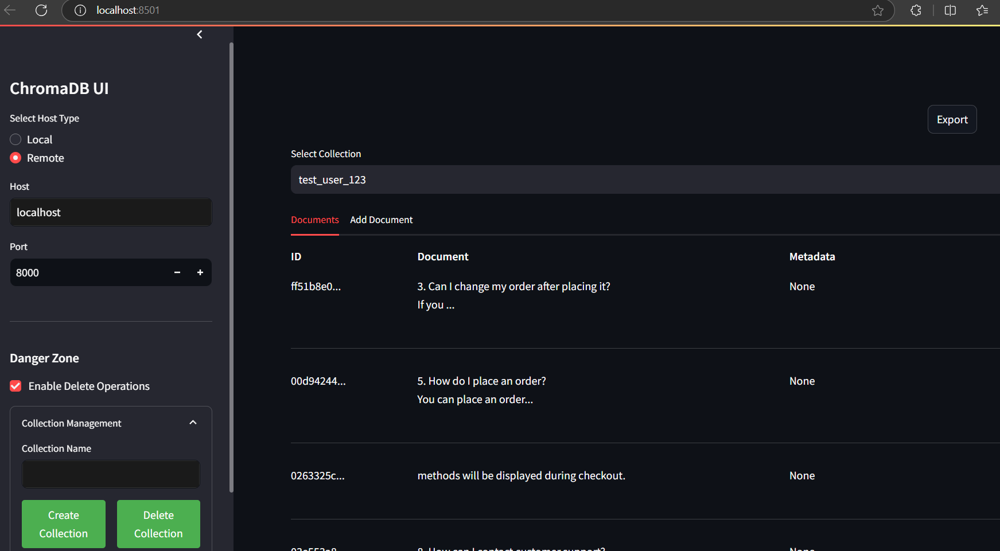

# ChromaDB UI

A simple and intuitive user interface for managing ChromaDB collections and documents. This project provides a web-based interface built with Streamlit to interact with ChromaDB, making it easier to manage vector databases without writing code. originally built for my work and understanding of ChromaDB, but I thought it might be useful for others since i dont find useful chromadb ui while i was searching for one. 

## Features

- **Collection Management**
  - Create new collections
  - View existing collections
  - Delete collections (with safety toggle)

- **Document Operations**
  - Add documents with metadata
  - View documents in a clean, tabular format
  - Export collection data in json format

- **Connection Options**
  - Connect to local ChromaDB instance
  - Connect to remote ChromaDB server
  - Configurable host and port settings

## Installation

1. Clone the repository:
git clone https://github.com/m-saravana/chromadb-ui.git
cd chromadb-ui

2. Install the required dependencies:
pip install -r requirements.txt

3. Run the Streamlit app:
streamlit run app.py

4. Open your web browser and navigate to http://localhost:8501 to access the ChromaDB UI.

3. Use the sidebar to:
   - Select connection type (Local/Remote)
   - Configure remote connection settings
   - Create new collections
   - Enable/disable danger zone operations

## Project Structure

chromadb-ui/
├── app.py # Main application file
├── requirements.txt # Project dependencies
└── README.md # Project documentation

## Contributing

Contributions are welcome! Please feel free to submit a Pull Request.

1. Fork the repository
2. Create your feature branch (`git checkout -b feature/AmazingFeature`)
3. Commit your changes (`git commit -m 'Add some AmazingFeature'`)
4. Push to the branch (`git push origin feature/AmazingFeature`)
5. Open a Pull Request

## License

This project is licensed under the MIT License - see the [LICENSE](LICENSE) file for details.

## Acknowledgments

- Built with [Streamlit](https://streamlit.io/)
- Powered by [ChromaDB](https://www.trychroma.com/)

## Future Enhancements

- [ ] Advanced search functionality
- [ ] Batch document operations
- [ ] Document update capabilities
- [ ] Enhanced metadata management

# Contact

Project Link: [https://github.com/m-saravana/chromadb-ui](https://github.com/m-saravana/chromadb-ui)